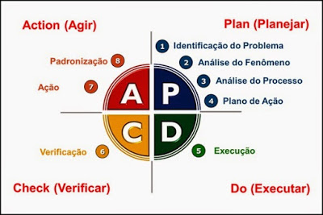

# Claude Certifications: Todos

Se trata de um projeto prático prova de conceito - POC para deixar pegadas digitais e um comprometimento público para aplicar o foco e disciplina e com isso  ser pró-ativo para os processos seletivos onde as equipes técnicas de recrutadores tenham condições e evidências para verificar se o meu perfil pode atender as necessidades das oportunidades.

## Visão do Projeto

Objetivo é focar  no uso prático real dos conceitos abstratos do conteúdo programático das certificações:

- Claude CCDV-F
  - [Claude Certified Developer – Foundations (CCDV-F)](https://anthropic-partners.skilljar.com/claude-certified-developer-foundations-certification)

Tendo em mente que para a presente Certificação:

- O Conteúdo programático identificar os objetivos;
- Para cada Objetivo dos Tópicos, explodir em habilidades;
- Para cada habilidade, identificar boas práticas de uso Empírico;
- Identificar a forma de como é cobrado o conhecimento no exame;
- identificar, em projetos open-source, o uso dos conceitos, na prática;
- Elaborar estratégias (checklists) de refatoração para aplicar boas práticas em projetos legados;

--- 

## Proficiências

Procuro evidência as proficiências nas seguintes habilidades técnicas:

- [Metodologia Básica de Análise de Algoritmos](#GOODRICH-Michael-T)
- Técnicas em [Análise Código-fonte Legados](#FEATHERS-michael);
- Técnicas em [Refatoração Código-fonte Legados](#FEATHERS-michael);
- Implementar Soluções usando algoritmos Reutilizáveis


Projeto inicializado com o [`Scripts de automação próprio`]().

## 🚀 Começando

### 🔧 Instalação

Para obter o presente projeto use os seguintes comandos:

```bash
mkdir -p "${HOME}/projetos"
cd "${HOME}/projetos"
git clone https://github.com/pssilva/agents-ia-certifications.git
cd agents-ia-certifications
source ~/.bash_profile
idea .
```


#### 📋 Pré-requisitos

Depois de baixar o projeto: De que coisas precisamos para atuar no projeto `agents-ia-certifications` e executá-lo?

Para isso, use os comandos do script de automação:

```bash

export ARTIFACT_ID="agents-ia-certifications"
export TOOL_NAME="ClaudeCertificationsScriptsUteis"
export SCRIPT_PATH="${HOME}/projetos${ARTIFACT_ID}/scripts"
export AUTOMATION_PATH="${SCRIPT_PATH}/src/main/automation"
export TOOL_PATH="${AUTOMATION_PATH}/${TOOL_NAME}"

source "${TOOL_PATH}/ClaudeCertificationsScriptsUteis_main.sh"

ClaudeCertificationsScriptsUteis.installAllTools

```

Para verificar o ambiente SDK, use os comandos do script de automação:

```bash

export ARTIFACT_ID="agents-ia-certifications"
export TOOL_NAME="ClaudeCertificationsScriptsUteis"
export SCRIPT_PATH="${HOME}/projetos/${ARTIFACT_ID}/scripts"
export AUTOMATION_PATH="${SCRIPT_PATH}/src/main/automation"
export TOOL_PATH="${AUTOMATION_PATH}/${TOOL_NAME}"

source "${TOOL_PATH}/check-ambiente-sdk.sh"
ClaudeCertificationsScriptsUteis.checkAmbienteSDK

```
Para criar a estrutura da [Técnica Feynman](https://youtu.be/CN_SCpGuJ_w?si=7eqvv5fpdCkjXVdz)! 
Onde temos `ClaudeCertificationsScriptsUteis.CriarStructureByConceito "{{NOME_MODULO}}" "{{CONCEITO}}"`. 
Use os seguintes comandos:

```bash
export ARTIFACT_ID="agents-ia-certifications"
export TOOL_NAME="ClaudeCertificationsScriptsUteis"
export SCRIPT_PATH="${HOME}/projetos/${ARTIFACT_ID}/scripts"
export AUTOMATION_PATH="${SCRIPT_PATH}/src/main/automation"
export TOOL_PATH="${AUTOMATION_PATH}/${TOOL_NAME}"

source "${TOOL_PATH}/claude-training-lab.sh"
ClaudeCertificationsScriptsUteis.CriarStructureByConceito "01-beyond-classes" "TituloConceitoXPTO_11"
```


Após instalar as ferramentas necessárias.
Executar o projeto `ccdvf-claude-developer`, use os seguintes comandos:

```bash
export ARTIFACT_ID_PARENT="agents-ia-certifications"
export ARTIFACT_ID="ccdvf-claude-developer"
cd "${HOME}/projetos/${ARTIFACT_ID_PARENT}/${ARTIFACT_ID}"
source ~/.bash_profile
idea .
```

---

## 🔩 Débitos Técnicos

Aqui temos uma lista do que identificamos com status de pendente:

### Funcionalidades Aplicação

Segue abaixo (não se limita) os objetivos do presente projeto:

- [X] ~~Formatando documentação README.md~~s

### Tópicos da Certificação

Tomando como base [Claude Certified Developer – Foundations (CCDV-F)](https://anthropic-partners.skilljar.com/claude-certified-developer-foundations-certification), temos:

- Domínios:
  - [ ] 1 Agents and Workflows 14.7%
  - [ ] 2 Applications and Integration 33.1%
  - [ ] 3 Claude Code 3.1%
  - [ ] 4 Eval, Testing, and Debugging 2.6%
  - [ ] 5 Model Selection and Optimization 16.8%
  - [ ] 6 Prompt and Context Engineering 11.0%
  - [ ] 7 Security and Safety 8.1%
  - [ ] 8 Tools and MCPs 10.6%

### Atividades - DevOps

- [ ] Scritps de Automação
  - [X] ~~instalação das Ferramentas de Desenvolvimento.~~
  - [ ] Criar automação para as principais funcionalidade (features) disponíveis no Java SE
- [ ] [Metodologia Básica de Análise de Algoritmos](#GOODRICH-Michael-T)
  - Aplicar técncia para [Análise Explorativa da Implementação dos Artefatos](#da-analise-exploratoria)
- [ ] [Implementar Testes (TDD)](#GONZALEZ_Javier_cap_11): Técnica Red-Green-Refact
- [ ] Descrição sucinta [TRABALHO EM PROGRESSO]

- [ ] Implementação dos Pipelines CI/CD de Implatação num Provedor de Nuvem (mais detalhes veja [aqui](docs/provedores_nuvem/README.md)).
- [ ] Implementar restrições de Commit no Git: vinculado com o ID de regra de negócio e ID do checklist de validação das entragas de funcionalidades (mais detalhes [aqui](docs/checklists/README.md))
- [ ] Implementar Dockerfiles para Kubernetes
- [ ] Colocar em prática o Desenvolvimento Orientado a Interface onde se deve desacoplar a aplicação do procedor de nuvem (Princípio da Segregação de Interface (ISP) - SOLID) (mais detalhes veja [aqui](docs/provedores_nuvem/README.md))
- [ ] Implementar Arquitetura Orienta a Eventos ([EDA](https://aws.amazon.com/pt/what-is/eda/))

### Suporte / Sustentação

- [ ] Abordagem API First e Implementação da Especificação do [OpenAPI (antido Swagger)](https://swagger.io/specification/) para integração com o back-end
- [ ] Clusterização da Solução em Diversas [VM em multicloud Nuvem]() para integração com o back-end

---

## 📦 Desenvolvimento

- [ ] Inplementar o gernciador de tarefas Gruntfile.js

### Mentalidade PDCA

Tendo em mente que sempre buscamos melhorar o protocolo de trabalho operacinal do dia a dia usando empirismo (colocar realmente em prática os conheicmentos abstratos):



---


---

## 🛠️ Construído com

Seque aqui as ferramentas utilizadas na construção presente projeto:

### Ferramentas

* [Docker](https://www.docker.com/get-started/)
* [NVM](https://github.com/nvm-sh/nvm?tab=readme-ov-file#intro) - Node Version Manager
* [Terminal Shell Linux (WSL)](https://learn.microsoft.com/pt-br/windows/wsl/install)


## 🖇️ Colaborando

Por favor, leia o [COLABORACAO.md](COLABORACAO.md) para obter detalhes sobre o nosso código de conduta e o processo para nos enviar pedidos de solicitação.

## 📌 Versão

Nós usamos [SemVer](http://semver.org/) para controle de versão. Para as versões disponíveis, observe as [tags neste repositório](https://github.com/suas/tags/do/projeto).

## ✒️ Autores

Mencione todos aqueles que ajudaram a levantar o projeto desde o seu início

* **Um desenvolvedor** - *Trabalho Inicial* - [pssilva](https://github.com/pssilva)


Você também pode ver a lista de todos os [colaboradores](COLABORACAO.md) que participaram deste projeto.

---

## 📄 Licença

Este projeto está sob a licença (sua licença) - veja o arquivo [LICENSE](LICENSE) para detalhes.

---


## Referências Usadas

Seque abaixo as referências bibliográficas usadas no presente projeto:

### Livros

---

<p align="justify">
[<a id="Pranshi-Verma">Pranshi Verma</a>]: Claude Certified Developer – Foundations (CCDV-F): The Complete Study Guide: 400 Exam-Ready Scenario Questions, Full Blueprint Coverage, and a Proven Study ... the CCDV-F Certification (English Edition) ASIN: B0HFJLL88D. 1381 páginas. 1st Edition,  17 agosto 2026 Disponível em: < <a href="https://a.co/d/0fDzDFIW">https://a.co/d/0fDzDFIW</a>>.Acesso em: 7 out. 2026.
</p>

---

### Vídeos / Playlists

---

Veja mais detalhes da estratégia de Indexação de vídeos [aqui](https://github.com/pssilva/agents-ia-certifications/blob/main/docs/indexacoes/README.md)